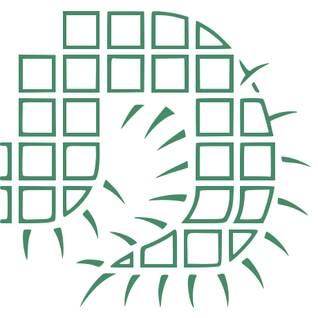

  
  <h1 style="margin:0;line-height:1.05;text-align:center;">
    The Matrix
    Centipede
    (New Sequence)
  </h1>
  

October 4th, 2025.

> We are unfashioned creatures, but half made up, if one nerdier, fussier, and stricter than ourselves—such a benchmark
> ought to be—do not lend its aid to perfectionate our weak and faulty natures.

October 5th, 2025.

> I agree with you; we are unfashioned creatures, if one younger, JetBrains-born, and island-named than ourselves—such a
> modern programming language ought to be—do play at baubles befitting its age, appropriate foreign artefacts, and
> desecrate the limbs of its forefathers.

## Security Policy

Please report any security issues using GitHub's private vulnerability reporting
or by emailing [yaroslav.riabtsev@rwth-aachen.de](mailto:yaroslav.riabtsev@rwth-aachen.de).
See the [security policy](.github/SECURITY.md) for full details.

## License

This project is open-source and available under the MIT License.
